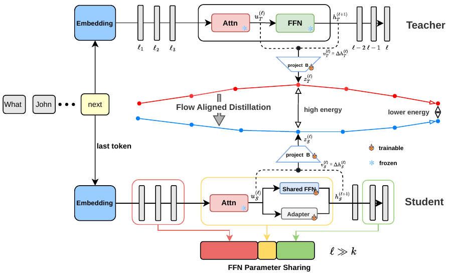

# FAD · Flow-Aligned Distillation

**A reproducible research portfolio for shared-FFN LLM compression and calibrated adaptive exit.**

[Live portfolio](https://hanklin9188.github.io/FAD-Portfolio/) · [繁體中文說明](README_zh-TW.md) · [Results](docs/RESULTS.md) · [Reproduce](reproduction/README.md) · [Deploy](deployment/README.md)



FAD compresses Llama-3.2-3B by mapping 28 decoder layers onto fewer unique FFN prototypes, then recovers the compressed model with decision-token cross entropy and a teacher-whitened transport objective. A four-feature controller chooses exit layer 16, 20, 24, or 28 at inference time.

## Headline results

All values below are zero-shot macro accuracy over PIQA, Social-IQA, WinoGrande, ARC-Challenge, ARC-Easy, HellaSwag, and OpenBookQA. The FAD checkpoints are the latest seed-44 restricted-late selections found in the project artifacts.

| Compression | Unique FFNs | FAD static | FAD + adaptive exit | Accuracy change | Average exit | Layer saving |
|---:|---:|---:|---:|---:|---:|---:|
| 15% | 22 / 28 | **85.38%** | **85.41%** | +0.04 pp | 17.32 | 38.16% |
| 20% | 19 / 28 | **85.66%** | **85.53%** | −0.14 pp | 18.16 | 35.16% |
| 25% | 17 / 28 | **85.03%** | **84.94%** | −0.10 pp | 16.39 | 41.47% |
| 30% | 15 / 28 | **83.20%** | **82.89%** | −0.31 pp | 17.16 | 38.70% |

At 25%, the matched H100 batch-1 run measures **1.465× aggregate throughput** and **1.388× task-wise geometric-mean speedup** versus the merged teacher. These are different metrics; both are preserved in [`runtime_25pct.csv`](data/processed/runtime_25pct.csv).

## Comparison with reproduced methods

| Method | 15% | 20% | 25% | 30% |
|---|---:|---:|---:|---:|
| [FLAP](https://github.com/CASIA-LMC-Lab/FLAP) | 70.59 | 68.00 | 63.89 | 57.87 |
| [Týr-the-Pruner](https://github.com/AMD-AGI/Tyr-the-Pruner) | 79.30 | 76.16 | 72.71 | 64.54 |
| [LLM-Streamline](https://github.com/RUCKBReasoning/LLM-Streamline) | 81.29 | 81.82 | 81.25 | 81.12 |
| **FAD · latest selected** | **85.38** | **85.66** | **85.03** | **83.20** |

The archived baseline wrappers defaulted to answer-length normalization while current FAD artifacts explicitly record `length_norm=none`. The table preserves the paper-era runs, but it should not be presented as a strictly identical current protocol until all methods are rerun. The public wrappers now fix every method to `none`; see the [protocol audit](docs/AUDIT.md).

## What is included

```text
FAD-Portfolio/
├── index.html, styles.css, app.js     interactive GitHub Pages portfolio
├── assets/                            paper figures and source manuscript
├── data/raw/                          selected evaluator/controller artifacts
├── data/processed/                    analysis-ready CSV tables
├── reproduction/fad/                  FAD pipeline snapshot and launch scripts
├── reproduction/baselines/            FLAP, Týr, Streamline adapters
├── deployment/web-demo/               25% student + teacher inference demo
├── docs/                              method, results, audit, and file guide
└── scripts/verify_data.py              executable provenance checks
```

Start with the [file-by-file guide](docs/FILE_GUIDE.md). To inspect the static site locally:

```bash
python -m http.server 8000
# open http://127.0.0.1:8000
```

To preview the model comparison UI without weights or a GPU:

```bash
bash deployment/web-demo/start-mock.sh 8765
python deployment/web-demo/smoke_test.py --base_url http://127.0.0.1:8765
```

## Reproducibility boundary

This repository includes code, configuration, compact raw result artifacts, figures, and ten curated HellaSwag examples with labels and historical outputs for the mock demo. It does **not** redistribute Meta Llama weights, merged teacher weights, the 25% student bundle, full benchmark corpora, or the full per-question benchmark record. Obtain each external asset under its own terms, then provide paths through environment variables. Expected model artifact checksums are listed in [`deployment/web-demo/models/README.md`](deployment/web-demo/models/README.md).

Run the repository audit with:

```bash
python scripts/verify_data.py
```

See [NOTICE.md](NOTICE.md) and [THIRD_PARTY.md](THIRD_PARTY.md) before reuse. No license is granted for unpublished FAD material by this repository.
